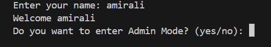
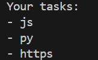
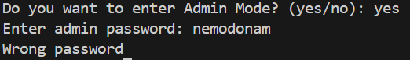
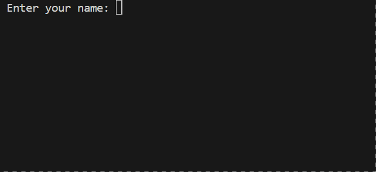

# Personal Task Manager


## Description

A simple task manager built with Python.

## Table of Contents

- [Features](#features)
- [Project Structure](#project-structure)
- [File Description](#file-description)
- [Requirements](#requirements)
- [Installation](#installation)
- [Environment Setup](#environment-setup)
- [Usage](#usage)
- [Example Output](#example-output)
- [Screenshot](#screenshot)
- [Demo](#demo)
- [Roadmap](#roadmap)
- [Contributing](#contributing)
- [License](#license)
- [Author](#author)

## Features
- Add tasks
- Show all tasks
- Save tasks to a file
- Admin Mode

## Project Structure
```text
personal_task_manager/
├── pictures/
├── gifs/
├── main.py
├── tasks.py
├── requirements.txt
├── .env.example
├── .gitignore
└── README.md
```

## File Description


- `main.py` - Main program file.
- `tasks.py` - Contains task functions.
- `requirements.txt` - Contains required packages.
- `.env.example` - Example environment variables.
- `.gitignore` - Files ignored by Git.
- `README.md` - Project documentation.

## Requirements
- python 3.12
- python-dotenv

## Installation
1. clone the repository.
2. open the project folder.
3. install the required packages:
   
```bash
pip install -r requirments.txt
```


## Environment Setup
1. Create a `.env` file from `.env.example`:
```bash
cp .env.example .env
```
2. Open the new `.env` file
3. Replace the example value with your own password:
```txt
QUIZ_ADMIN_PASSWORD=enter_your_password_here
```
4. Save the file.
   
> Do not commit your `.env` file because it may contain your private information

## Usage
run the program with :

```bash
python main.py
```

## Example Output
```text
Enter your name: amirali
Welcome amirali
Do you want to enter Admin Mode? (yes/no): no
Enter a task: py
Enter a task: js
Enter a task: https
Your tasks:
- py
- js
- https
```

## Screenshot

### 1. Start Program



### 2. Tasks



### 3. Admin Mode



## Demo


## Roadmap
- [x] Add tasks
- [x] Show tasks
- [x] Save tasks to a file
- [x] Add Admin Mode
- [ ] Add task search
- [ ] Add task editing


## Contributing

## License

## Author

AmirAli Bashiri

GitHub: [amirali-bashiri1](https://github.com/amirali-bashiri1)
